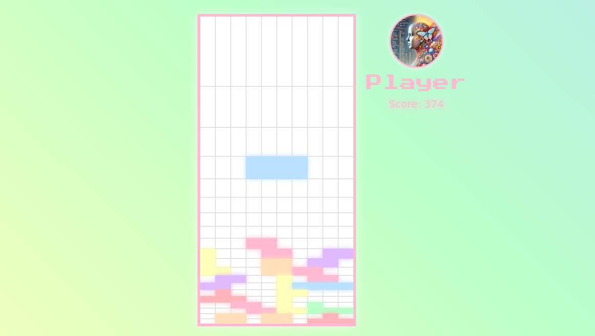

# LOGRIS: LOGarithmic tetRIS

## [Play Now](https://misslivirose.github.io/logris/logris.html)

**Logris** is a twist on the classic Tetris game, featuring a **logarithmic grid** where pieces visually shrink as they descend. This innovative mechanic, combined with vibrant animations and an ethereal design, creates a unique gameplay experience that challenges your spatial awareness and quick thinking.

## Features

- **Logarithmic Grid**: Pieces dynamically scale as they move downward, offering a fresh gameplay challenge.
- **Hard Drop**: Instantly drop pieces to the bottom of the grid with a single keypress.
- **Dynamic Difficulty**: Game speed increases as you score higher.
- **Pause Functionality**: Take a break anytime with a simple keypress.
---

## Controls
   - Move Left: `←`
   - Move Right: `→`
   - Soft Drop: `↓`
   - Hard Drop: `↑`
   - Rotate: `W` or `Q`
   - Pause/Resume: `Spacebar`

## Objective
Complete rows by fitting the falling pieces together. Earn points and keep the grid clear to avoid reaching the top.

